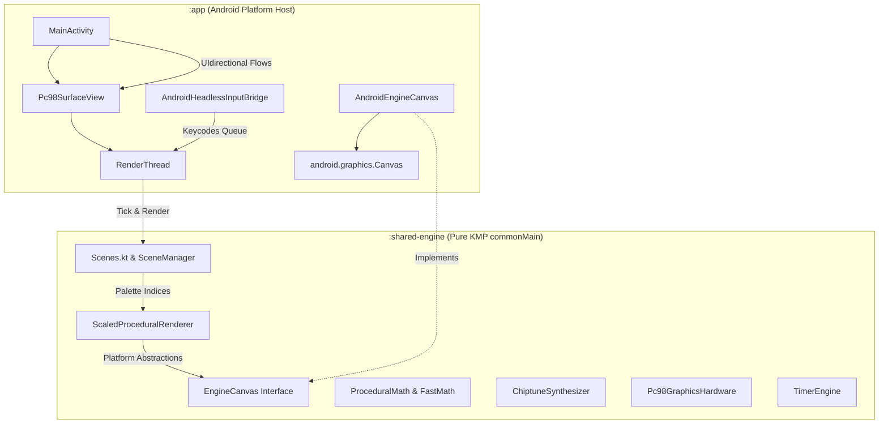

# TimeboxVibe: Codebase Audit & Architectural Overview

## 1. Executive Summary
This document provides an audited, factually accurate architectural overview of the **TimeboxVibe** application. The codebase adheres to the "Hardware Constraints as Feature" philosophy (**"Carmack but ZUN"**) and **"cpp but Kotlin"**, using a custom, low-level procedural rendering system to replicate early 90s PC-98 Japanese game aesthetics (Touhou).

The core visual rendering (the 魔法陣 magic circle, timer progress tracks, and danmaku bullet animations) and domain logic run entirely inside a dedicated, pure Kotlin Multiplatform module (`:shared-engine`), completely isolated from Java/JVM or Android dependencies. The rendering loop operates on a background thread inside an Android `SurfaceView` (`Pc98SurfaceView`) in the `:app` module, using a 16-color index-based drawing pipeline.

---

## 2. Directory & Module Breakdown



### `:shared-engine` — Pure KMP Core (`commonMain/kotlin/`)
This module represents the portable core of the application. It contains no Android/Java/JVM imports and compiles against metadata targets for Android, iOS, and Windows.

#### `com.example.timeboxvibe.engine` (Common Assets & Models)
*   **[ToneSpec.kt](file:///d:/Programes/TimeBox/shared-engine/src/commonMain/kotlin/com/example/timeboxvibe/engine/ToneSpec.kt)**: Defines standard chiptune parameters (frequency, envelope, type, duration, and ADSR bounds) for chiptune synthesis.
*   **[SoundMelodies.kt](file:///d:/Programes/TimeBox/shared-engine/src/commonMain/kotlin/com/example/timeboxvibe/engine/SoundMelodies.kt)**: Algorithmic chiptune melodies (Bad Apple, Senbonzakura, Zen Chime) generated purely via mathematical note intervals.
*   **[ShinonomeFont.kt](file:///d:/Programes/TimeBox/shared-engine/src/commonMain/kotlin/com/example/timeboxvibe/engine/ShinonomeFont.kt)**: Houses the raw 16x16 bitmap pixel matrix data for retro typography.
*   **[Strings.kt](file:///d:/Programes/TimeBox/shared-engine/src/commonMain/kotlin/com/example/timeboxvibe/engine/Strings.kt)**: Platform-independent translation tables mapping Chinese, Japanese, and English UI labels.
*   **[DefaultPresets.kt](file:///d:/Programes/TimeBox/shared-engine/src/commonMain/kotlin/com/example/timeboxvibe/engine/DefaultPresets.kt)**: The default timeboxing chronograph presets (Classic Dual, Trio Dual.5, Decremental, Incremental).

#### `com.example.timeboxvibe.engine.core` (Low-level Engine & Primitives)
*   **[TimerEngine.kt](file:///d:/Programes/TimeBox/shared-engine/src/commonMain/kotlin/com/example/timeboxvibe/engine/core/TimerEngine.kt)**: The state machine managing Pomodoro countdowns, sequence progression, and mode changes.
*   **[ProceduralMath.kt](file:///d:/Programes/TimeBox/shared-engine/src/commonMain/kotlin/com/example/timeboxvibe/engine/core/ProceduralMath.kt)**: Houses Bresenham's Midpoint Circle Algorithm (`drawBresenhamCircle`) and the `FastMath` Sine/Cosine Lookup Table (LUT). The LUT uses a 1024-element array to bypass CPU-heavy native trigonometric calls in the render loop.
*   **[ScaledProceduralRenderer.kt](file:///d:/Programes/TimeBox/shared-engine/src/commonMain/kotlin/com/example/timeboxvibe/engine/core/ScaledProceduralRenderer.kt)**: High-level vector plotter that translates geometry (Zun magic circles, progress chronograph segments, glyph typography, and orbiting bullets) into pure index-based canvas calls.
*   **[ChiptuneSynthesizer.kt](file:///d:/Programes/TimeBox/shared-engine/src/commonMain/kotlin/com/example/timeboxvibe/engine/core/ChiptuneSynthesizer.kt)**: Polyphonic software audio synthesizer. Generates Waveforms (Square, Pulse-width Sweeps, Triangle, and Metallic Noise), ADSR envelopes, and applies soft clipping—completely allocation-free.
*   **[Pc98GraphicsHardware.kt](file:///d:/Programes/TimeBox/shared-engine/src/commonMain/kotlin/com/example/timeboxvibe/engine/core/Pc98GraphicsHardware.kt)**: Hardware palette emulator containing 16 slots of 12-bit packed colors (`ShortArray` mapping to `0x0RGB` format). Tracks palette updates via a volatile `paletteRevision` counter.
*   **[EngineCanvas.kt](file:///d:/Programes/TimeBox/shared-engine/src/commonMain/kotlin/com/example/timeboxvibe/engine/core/EngineCanvas.kt)**: Platform-agnostic drawing interface. Defines operations (`clear`, `setPixel`, `drawLine`, `drawRect`, `drawCircle`, `fillRectDither`) that accept only 4-bit `colorIndex: Int` values.
*   **[Scenes.kt](file:///d:/Programes/TimeBox/shared-engine/src/commonMain/kotlin/com/example/timeboxvibe/engine/core/Scenes.kt) & [SceneManager.kt](file:///d:/Programes/TimeBox/shared-engine/src/commonMain/kotlin/com/example/timeboxvibe/engine/core/SceneManager.kt)**: State machine router managing active screens (Main Menu, customizing templates, settings, dither-filled entropy lists, and full-screen blocking overlays).
*   **[FixedInputContainer.kt](file:///d:/Programes/TimeBox/shared-engine/src/commonMain/kotlin/com/example/timeboxvibe/engine/core/FixedInputContainer.kt)**: Headless input character array buffer to bypass GC heap allocations during text editing.

---

### `:app` — Android Platform Host (`src/main/java/`)
Adapts the KMP shared engine to the Android platform, supplying the hardware SurfaceView and mapping raw drawings to Android's graphics library.

*   **[AndroidEngineCanvas.kt](file:///d:/Programes/TimeBox/app/src/main/java/com/example/timeboxvibe/platform/android/AndroidEngineCanvas.kt)**: Implements `EngineCanvas` using an Android hardware-accelerated `android.graphics.Canvas`.
    *   **RAMDAC Caching**: Maintains a local `cachedNativePalette: IntArray(16)` cache. It checks if `Pc98GraphicsHardware.paletteRevision` has updated at the start of drawing calls; if so, it converts the 12-bit `0x0RGB` shorts into Android standard `0xAARRGGBB` ARGB integers once via a bit-shifting hack and updates the cache.
    *   Subsequent drawing operations read from the cache in $O(1)$ time, making hot-path rendering bitwise-free.
*   **[Pc98SurfaceView.kt](file:///d:/Programes/TimeBox/app/src/main/java/com/example/timeboxvibe/ui/main/Pc98SurfaceView.kt)**: Manages the background `RenderThread` that locked-closes the canvas, applies target density scaling, and executes the active scene ticks at ~60fps.
*   **[AndroidHeadlessInputBridge.kt](file:///d:/Programes/TimeBox/app/src/main/java/com/example/timeboxvibe/platform/android/AndroidHeadlessInputBridge.kt)**: Attaches an invisible `EditText` to capture soft keyboard inputs and feeds them to the engine input queue.
*   **[MainActivity.kt](file:///d:/Programes/TimeBox/app/src/main/java/com/example/timeboxvibe/MainActivity.kt)**: Entry activity, binds the ViewModel state flow to redraw triggers, and registers platform haptics / keyboards.

---

## 3. Rendering Pipeline Analysis (Logical Flow)

```text
 [1] ViewModel State change emitted
        │
        ▼ (Unidirectional Flow)
 [2] MainActivity sets Pc98SurfaceView.isViewDirty = true
        │
        ▼ (Awaken Loop)
 [3] RenderThread wakes up, locks Android Canvas, scales by density
        │
        ▼ (Delegate Tick)
 [4] Active Scene tick updates inputs and calls render(renderer)
        │
        ├─► [4a] EngineThemes writes 12-bit Short colors to Pc98GraphicsHardware
        │        and increments paletteRevision
        │
        └─► [4b] ScaledProceduralRenderer plot shapes passing 4-bit colorIndex
                 directly to AndroidEngineCanvas
                      │
                      ▼ (Platform JIT Resolution)
            [5] AndroidEngineCanvas checks paletteRevision:
                - If updated: Converts 12-bit Shorts to 32-bit ARGB via bit-shifting
                              and repopulates cachedNativePalette
                - Performs standard drawRect/drawLine using resolved ARGB color
                      │
                      ▼ (Surface Swap)
            [6] RenderThread unlocks and posts the frame to GPU VRAM
```

---

## 4. Key Strengths & Quality Measures

1. **Strict Target Purity**: By physically locating the engine code inside `:shared-engine`'s `commonMain`, the KMP compiler acts as our guillotine, guaranteeing that no Android SDK (`android.*`) or Java runtime (`java.*`) classes leak into our domain logic.
2. **Zero-Allocation Hot Path**: Particle systems, trig computations, geometry plotting, and typography glyphs use pre-allocated static tables or primitive array structures (`IntArray`, `ShortArray`, `FloatArray`). No object allocations occur inside the render loop.
3. **RAMDAC Cache Efficiency**: Shifting 12-bit to 32-bit color resolution to a revision-based platform cache removes bitwise conversions from individual pixel plots, reducing color lookup to a flat $O(1)$ array read per primitive call.
4. **Authentic PC-98 Restrictions**: Forcing all drawing calls to use a 4-bit index limits active simultaneous colors to exactly 16, ensuring retro visual consistency and allowing instant palette swap animations.
